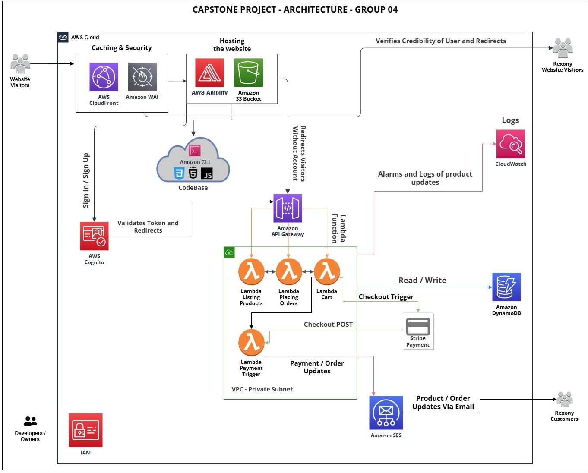

# Rexony — Infrastructure (`caa900-IAC-grp04`)

Terraform infrastructure-as-code for the **CAA900 Capstone Project · Group 04**.
This repository provisions **all AWS resources** for the Rexony platform and outputs the values needed to configure the frontend and backend repos.

- Frontend → [`caa900-fp-grp04`](https://github.com/R3X0N05/caa900-fp-grp04)
- Backend Lambda code → [`caa900-BE-grp04`](https://github.com/R3X0N05/caa900-BE-grp04)

---

## Authors

- **Selva Roshan Sivagnanasundaram Rexon** (126332246) — [@R3X0N05](https://github.com/R3X0N05)
- **Tony Vu** (132798527) — [@tvu006](https://github.com/tvu006)

## Architecture



> Website visitors hit **CloudFront + WAF** for caching and security, then reach the **Amplify**-hosted SPA. The frontend authenticates through **Cognito**, calls **API Gateway** (JWT-protected), which routes to the appropriate **Lambda** function. Orders, products, and cart are stored in **DynamoDB**. The payment Lambda runs in a **VPC private subnet** and calls **Stripe**. Order events trigger **SES** confirmation emails via DynamoDB Streams. **CloudWatch** captures logs and alarms. All infrastructure is defined and deployed from this repository via Terraform.

---

## Stack

- Terraform ≥ 1.5
- AWS (`us-east-1`)
- S3 + DynamoDB (remote state + lock)
- GitHub OIDC (keyless CI/CD for all 3 repos)
- SonarQube (static analysis)

---

## Repository Structure

```
caa900-IAC-grp04/
├── main.tf                  # Provider, backend (S3 + DynamoDB lock), account data
├── variables.tf             # All input variables with defaults
├── cognito.tf               # User Pool, App Client, custom:role attribute
├── dynamodb.tf              # Products, Orders, Cart tables (Streams on Orders)
├── lambda.tf                # 6 Lambda functions, IAM roles, DynamoDB Stream trigger
├── api_gateway.tf           # REST API, routes, Cognito Authorizer, stage deployment
├── amplify.tf               # Amplify app + testtf branch (frontend hosting)
├── ses.tf                   # SES email identity
├── secrets.tf               # Secrets Manager — rexony/backend (Stripe + SES)
├── iam.tf                   # Lambda execution roles, GitHub OIDC roles
├── outputs.tf               # URLs + IDs to copy into frontend/backend config
├── bootstrap.sh             # One-time setup — creates S3 state bucket + DynamoDB lock table
├── sonar-project.properties # SonarQube static analysis config
├── terraform.tfvars.example # Template for required secret values
├── .gitignore
└── .github/workflows/       # Terraform plan / apply pipeline
```

---

## Architecture

```
Amazon Cognito
  └── rexony-user-pool  ·  rexony-users client  ·  custom:role attribute

API Gateway (REST)  ← Cognito JWT Authorizer
  ├── /products        → Lambda: rexony-products
  ├── /cart            → Lambda: rexony-cart
  ├── /orders          → Lambda: rexony-orders
  ├── /payment         → Lambda: rexony-payment
  └── /admin/users     → Lambda: rexony-users

DynamoDB (PITR enabled on all tables)
  ├── Products
  ├── Orders  ──── Streams ──→  Lambda: rexony-sns  ──→  SES
  ├── Cart
  └── Reviews

AWS Secrets Manager
  └── rexony/backend  (STRIPE_SECRET_KEY + FROM_EMAIL)

AWS Amplify
  └── testtf branch  (Terraform-managed frontend deploy)

GitHub OIDC IAM Roles
  ├── github_be_role_arn   ← caa900-BE-grp04 deploy workflow
  ├── github_fp_role_arn   ← caa900-fp-grp04 deploy workflow
  └── github_iac_role_arn  ← caa900-IAC-grp04 apply workflow
```

---

## Terraform vs Backend Repo

| This repo (infrastructure) | `caa900-BE-grp04` (backend) |
|---|---|
| Lambda resources, memory, timeout, runtime | Lambda source code and handler logic |
| IAM execution roles and policies | DynamoDB access patterns |
| API Gateway routes and Cognito Authorizer | Request/response shapes |
| DynamoDB tables and Streams config | Business logic |
| Secrets Manager secret and initial values | Secret retrieval at runtime |
| Amplify app and branch config | — |
| GitHub OIDC roles for all 3 repos | — |

---

## Prerequisites

- [Terraform](https://developer.hashicorp.com/terraform/downloads) ≥ 1.5
- AWS CLI v2 with admin credentials:
  ```bash
  aws configure
  ```
- An AWS account with SES in **us-east-1** (or your chosen region)
- A **GitHub personal access token** (`repo` scope) for Amplify to pull the frontend repo
- A **Stripe secret key** — added manually to Secrets Manager after first apply (see below)

---

## Variables

| Variable | Default | Sensitive | Description |
|---|---|---|---|
| `aws_region` | `us-east-1` | No | AWS region for all resources |
| `github_org` | `R3X0N05` | No | GitHub username or org |
| `be_repo` | `caa900-BE-grp04` | No | Backend repo name |
| `fp_repo` | `caa900-fp-grp04` | No | Frontend repo name |
| `iac_repo` | `caa900-IAC-grp04` | No | IAC repo name |
| `from_email` | `azure.allure99@gmail.com` | No | SES-verified sender address |
| `github_token` | *(required)* | **Yes** | GitHub PAT for Amplify |

---

## Quick Start

### 1 — Bootstrap remote state (first time only)

```bash
chmod +x bootstrap.sh
./bootstrap.sh
```

This creates the S3 bucket and DynamoDB lock table that Terraform uses to store state. Run once per AWS account — never again.

### 2 — Create your variables file

```bash
cp terraform.tfvars.example terraform.tfvars
```

Fill in required values:

```hcl
github_token = "ghp_XXXXXXXXXXXXXXXXXXXXXXXXXXXX"
from_email   = "noreply@yourdomain.com"       # must be SES-verified
```

### 3 — Initialise

```bash
terraform init
```

### 4 — Preview

```bash
terraform plan
```

### 5 — Apply

```bash
terraform apply
```

Type `yes` when prompted. First-time apply takes approximately **3–5 minutes**.

---

## After Apply — Required Manual Steps

`terraform output manual_steps` prints the full checklist. Key actions:

**1. Set the Stripe secret key**

Terraform creates `rexony/backend` in Secrets Manager with a placeholder for `STRIPE_SECRET_KEY`. Replace it in the AWS Console:

```
AWS Console → Secrets Manager → rexony/backend → Retrieve secret value → Edit
```

Set `STRIPE_SECRET_KEY` to your real Stripe key (`sk_test_…` or `sk_live_…`).
Terraform will not overwrite this on future applies.

**2. Verify SES email**

Check your inbox for the SES verification email and click the link. Lambda functions cannot send email until the identity is verified.

**3. Update `aws-config.js` in the frontend repo**

Copy these Terraform outputs into `aws-config.js`:

| Terraform Output | `aws-config.js` field |
|---|---|
| `api_gateway_url` | `API_BASE` |
| `cognito_user_pool_id` | `USER_POOL_ID` |
| `cognito_client_id` | `CLIENT_ID` |
| `amplify_url` | Reference — update Cognito callback URL if needed |

**4. Set GitHub environment secrets in each repo**

| Repo | Environment | Secret | Value |
|---|---|---|---|
| `caa900-BE-grp04` | `production` | `AWS_ROLE_ARN` | `github_be_role_arn` output |
| `caa900-fp-grp04` | `production` | `AWS_ROLE_ARN` | `github_fp_role_arn` output |
| `caa900-IAC-grp04` | `production` | `AWS_ROLE_ARN` | `github_iac_role_arn` output |

All three repos also need `AWS_REGION` = `us-east-1`.

---

## All Outputs

```bash
terraform output
```

| Output | Purpose |
|---|---|
| `api_gateway_url` | Paste into `aws-config.js` → `API_BASE` |
| `cognito_user_pool_id` | Paste into `aws-config.js` → `USER_POOL_ID` |
| `cognito_client_id` | Paste into `aws-config.js` → `CLIENT_ID` |
| `amplify_app_id` | Set as `AMPLIFY_APP_ID` in FP repo GitHub environment |
| `amplify_url` | Frontend URL for the `testtf` branch |
| `github_be_role_arn` | Set as `AWS_ROLE_ARN` in BE repo GitHub prod environment |
| `github_fp_role_arn` | Set as `AWS_ROLE_ARN` in FP repo GitHub prod environment |
| `github_iac_role_arn` | Set as `AWS_ROLE_ARN` in IAC repo GitHub prod environment |
| `manual_steps` | Full post-deployment checklist |

---

## CI/CD

```
Developer
   │
   └── push to main ──► .github/workflows ──► terraform plan (PR)
                                          ──► terraform apply (merge)
```

The workflow authenticates via GitHub OIDC using `github_iac_role_arn` — no static AWS credentials stored in GitHub.

---

## Updating Infrastructure

Edit the relevant `.tf` file, then:

```bash
terraform plan    # review the diff
terraform apply   # apply
```

Terraform modifies only changed resources. Unaffected infrastructure is untouched.

---

## Teardown

```bash
terraform destroy
```

> ⚠️ Permanently deletes all resources including DynamoDB tables and data. Back up any data before running this.

The Secrets Manager secret has `recovery_window_in_days = 0`, so it is deleted immediately with no recovery period.

---
